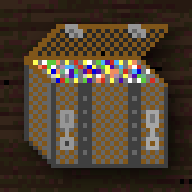

# Jewelbox - Web Port

A web port of **Jewelbox**, aiming to be as accurate as possible to the original Mac OS Classic game.

**Play it:** [https://yqnn.github.io/jewelbox-web-port](https://yqnn.github.io/jewelbox-web-port)

## About the original Jewelbox

**Jewelbox** is a falling-block puzzle game inspired by Sega's _Columns_. It was developed by **Rodney and Brenda Jacks** (Varcon Systems), with music by **Jim Holt**, and originally released as shareware in **July 1992** for Mac OS System 6 and later (Mac OS Classic).

More details: [Jewelbox on Wikipedia](<https://en.wikipedia.org/wiki/Jewelbox_(video_game)>).

## Copyright

**Credits**

| Asset            | Author                  | Licence |
| ---------------- | ----------------------- | ------- |
| visuals          | Rodney and Brenda Jacks |         |
| background music | Jim Holt                |         |
| sound effects    | Rodney and Brenda Jacks |         |

## Classic Mac game collection

<table>
<tr><td>

</td><td></td></tr>
</table>
